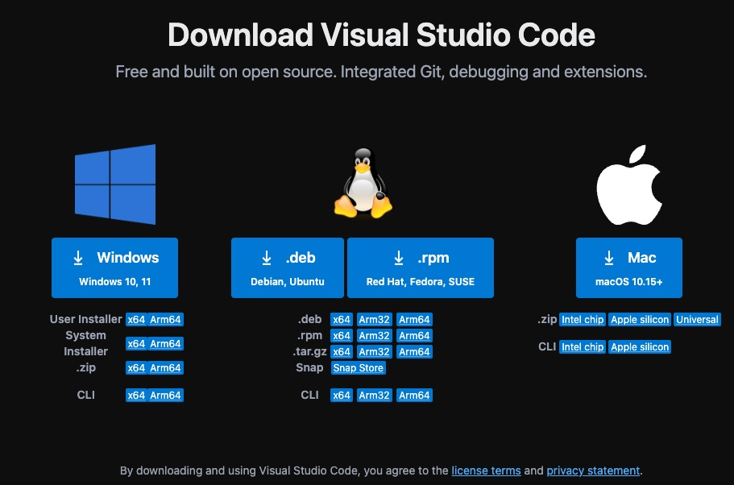
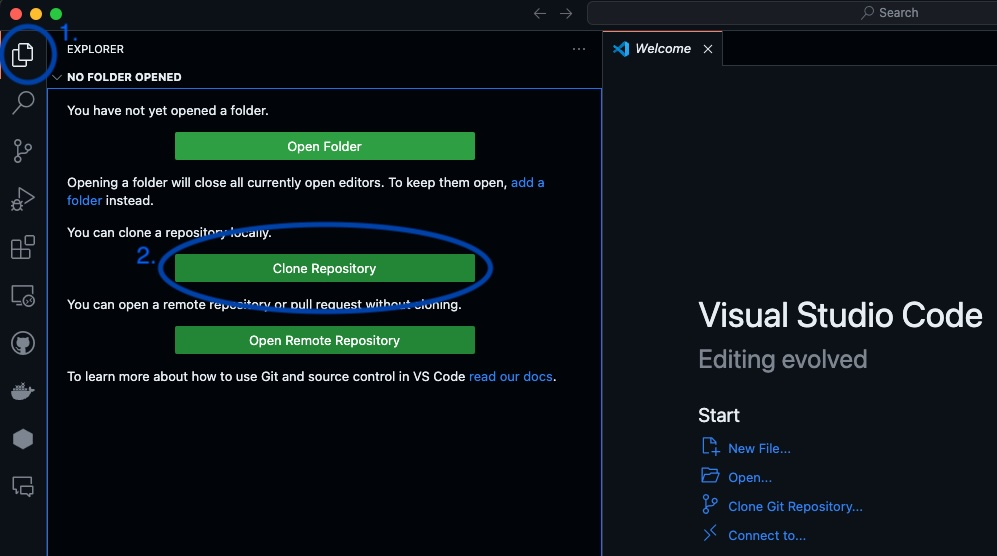
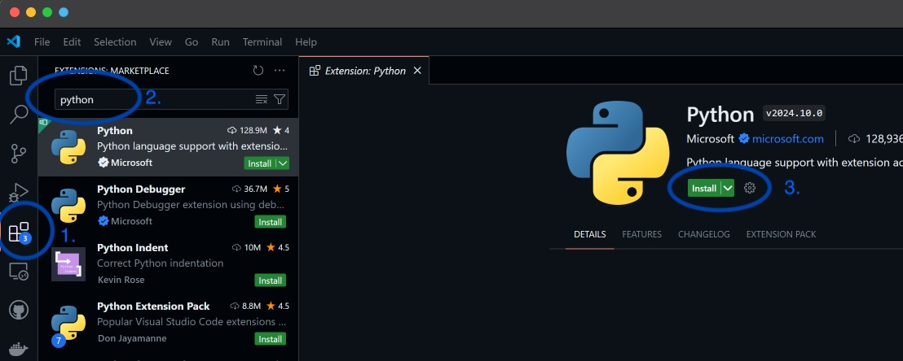
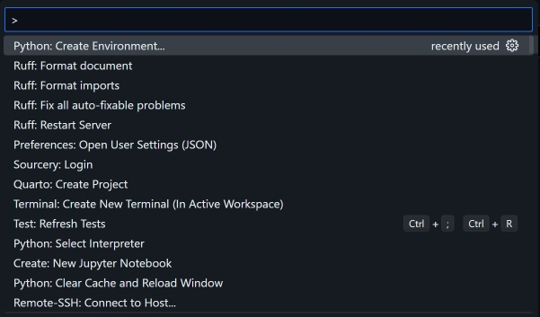
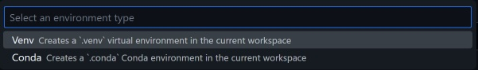
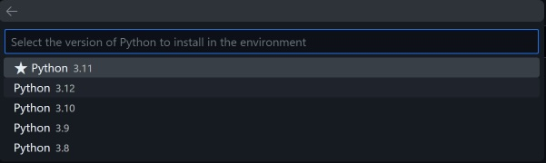
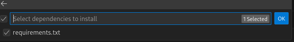

## Local Setup
The local setup involves installing several things:
1. Python
2. Git
3. VSCode
4. VSCode Python & Jupyter extensions
5. Python Packages

You may be able to skip installing git if you already have it installed from the git workshop

The full setup instructions are:
Python
1. Navigate to  the website https://www.python.org/downloads/ with your web browser.
2. Download Python 3.13 (3.13.7 is fine) for your operating system
3. Run the installer, following all prompts using the default settings
Git
4. Navigate to the website https://git-scm.com/downloads with your web browser
5. Download git for your operating system
6. Run the installer, following all prompts using the default settings  
VSCode
7. Navigate to the website https://code.visualstudio.com/ with your web browser.
8. Download Visual Studio Code for your specific platform/Operating System.

    
9. Run the Visual Studio Code Installer and follow all prompts.
10. Open Visual Studio Code, navigate to the File Explorer and clone this repository with the following repository name `https://github.com/CurtinIDS/CIDS_Carpentries_Python` into your preferred folder destination.

    
11. Navigate to the Extension sidebar then search for and install the Python and Jupyter extensions.

    
12. Enter the Visual Studio Code Command Pallette using `Ctrl + Shift + P` (Windows) or `Command + Shift + P` (MacOS) and locate `Python: Create Environment`.

    
13. Select `venv`.

    
14. Select `Python 3.13`. (the version you just installed)

    
15. When asked to "Select dependencies to install", click the box next to requirements.txt and click "ok"
    
    
You should now be done!

ONLY if you didn't do the step above when creating the virtual environment (venv):
1. Open Command Prompt or Terminal within Visual Studio Code using `Ctrl + J` (Windows) or `Command + J` (MacOS). Make sure the "Terminal" tab is selected, and you're in the previously cloned directory
2. Activate the created environment using the following command.
    Windows 11 (powershell):
    `.\.venv\Scripts\Activate.ps1`  
    Mac/Linux:
    `source ./venv/bin/activate`  
4. Run the following command to install dependencies while in the activated environment.
    `pip install -r requirements.txt`

### Google Colab
If you were unable to complete the above steps, you may alternatively access the workshop material using Google Colaboratory (colab) as an emergency measure. Please ensure that you have a Google Account.
1. [Episode 1 - Python Fundamentals](https://colab.research.google.com/github/CurtinIDS/CIDS_Carpentries_Python/blob/main/notebooks_colab/1_Python_Fundamentals_colab.ipynb)
2. [Episode 2 - Analysing Patient Data](https://colab.research.google.com/github/CurtinIDS/CIDS_Carpentries_Python/blob/main/notebooks_colab/2_Analysing_Patient_Data_colab.ipynb)
3. [Episode 3 - Visualising Tabular Data](https://colab.research.google.com/github/CurtinIDS/CIDS_Carpentries_Python/blob/main/notebooks_colab/3_Visualising_Tabular_Data_colab.ipynb)
4. [Episode 4 - Storing Multiple Values in Lists](https://colab.research.google.com/github/CurtinIDS/CIDS_Carpentries_Python/blob/main/notebooks_colab/4_Storing_Multiple_Values_in_Lists_colab.ipynb)
5. [Episode 5 - Repeating Actions with Loops](https://colab.research.google.com/github/CurtinIDS/CIDS_Carpentries_Python/blob/main/notebooks_colab/5_Repeating_Actions_with_Loops_colab.ipynb)
6. [Episode 6 - Analysing Data from Multiple Files](https://colab.research.google.com/github/CurtinIDS/CIDS_Carpentries_Python/blob/main/notebooks_colab/6_Analysing_Data_from_Multiple_Files_colab.ipynb)
7. [Episode 7 - Making Choices](https://colab.research.google.com/github/CurtinIDS/CIDS_Carpentries_Python/blob/main/notebooks_colab/7_Making_Choices_colab.ipynb)
8. [Epsiode 8 - Creating Functions](https://colab.research.google.com/github/CurtinIDS/CIDS_Carpentries_Python/blob/main/notebooks_colab/8_Creating_Functions_colab.ipynb)
9. [Episode 9 - Data Analysis with Pandas](https://colab.research.google.com/github/CurtinIDS/CIDS_Carpentries_Python/blob/main/notebooks_colab/9_Data_Analysis_with_Pandas_colab.ipynb)

[//]: # (Note for people editing this file. To create a colab link, combine the prefix:)

[//]: # (https://colab.research.google.com/github/)

[//]: # (With a link to the file in that repo including the blob/main, e.g.:)

[//]: # (CurtinIDS/CIDS_Carpentries_Python/blob/main/notebooks_colab/1_Python_Fundamentals_colab.ipynb)